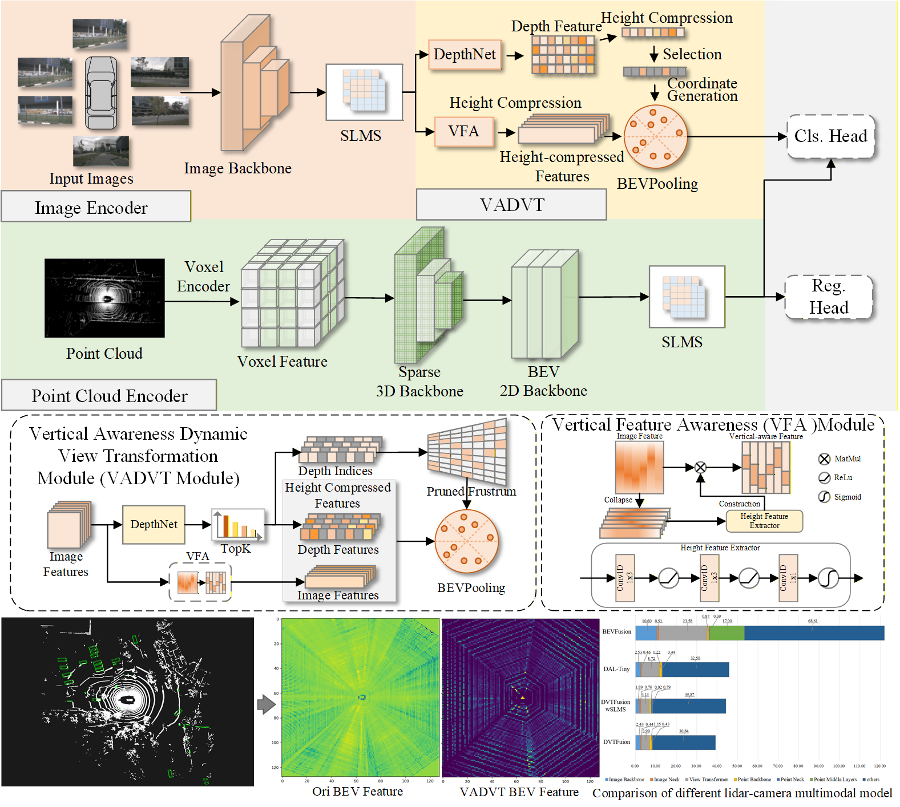

# DVTFusion

Source code of DVTFusion. 



## TODO
```

More information will be released.

The weight file will be open source once all authors agree.

Just follow the BEVDet repo to configure this repo.

```
## Acknowledgement
This project was completed based on BEVDet, and we thank BEVDet for its open-source nature. The link to BEVDet is as follows: https://github.com/HuangJunJie2017/BEVDet

## Citation
If you find our work useful, please consider cite our REPO. 
```

```
